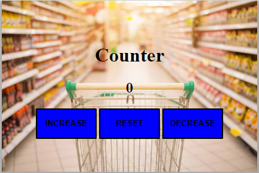

# javascript counter




Javascript counter is a simple counter for practising javascript from basics. Pressing the buttons on the app you can increase, decrement or reset the number on the screen.


## Using javascript counter

To use javascript counter, follow these steps:

```
press the button increase to increase the number on the screen
press the button decrease to decrease the number on the screen
press the button reset to reset the number on the screen
this app doesn't accept negative numbers
this app can count until number 100
```
You can find the app deployed on github pages at the address https://aline89b.github.io/javascript-counter/.

## Contributing to javascript counter

To contribute to javascript counter, follow these steps:

1. Fork this repository.
2. Create a branch: `git checkout -b main`.
3. Make your changes and commit them: `git commit -m '<commit_message>'`
4. Push to the original branch: `git push origin main`
5. Create the pull request.

Alternatively see the GitHub documentation on [creating a pull request](https://help.github.com/en/github/collaborating-with-issues-and-pull-requests/creating-a-pull-request).

## Contact

If you want to contact me you can reach me at <a.grianti89@gmail.com>.
